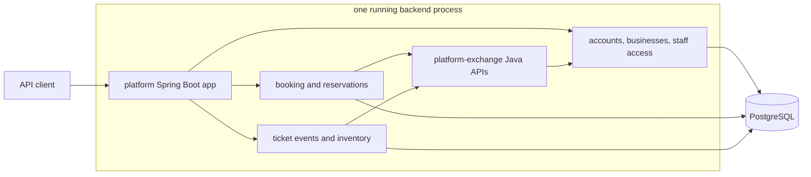
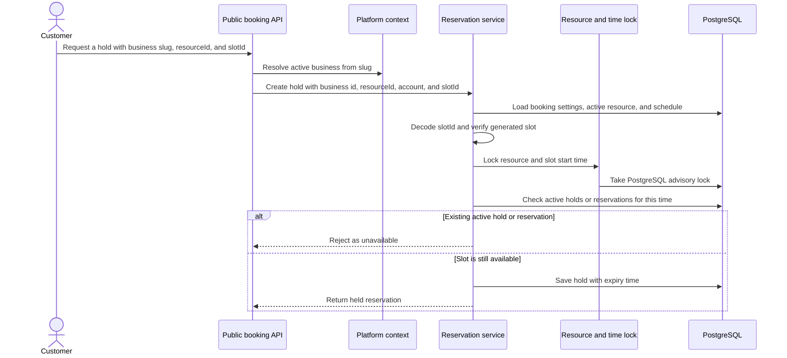
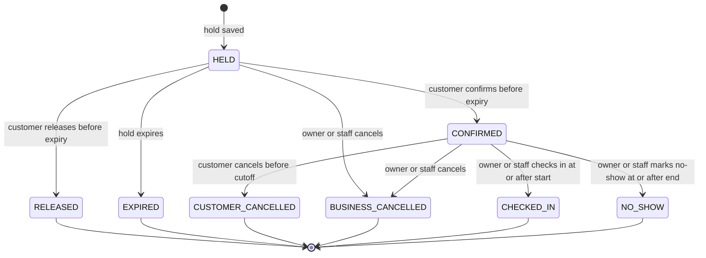

# resrv

[](https://github.com/jaeyeopme/resrv/actions/workflows/ci.yml)

`resrv` is a Java 25 + Spring Boot 4 backend for business reservation workflows.

It focuses on backend API behavior rather than a full product UI: accounts,
businesses, staff access, booking rules, resources, schedules, generated slots,
and reservations.

## Highlights

- The backend is split into five Gradle modules: `platform`, `timeslot`,
  `ticketing`, `platform-exchange`, and `shared-kernel`.
- JWTs identify the account only. Business access and reservation ownership are
  checked on the server.
- Sensitive lookups do not reveal whether an object is missing or belongs to
  another business.
- Slots are generated from booking settings and schedules instead of stored in a
  slot table.
- Hold creation locks the resource/time pair and checks active reservations
  before saving a new hold.
- OpenAPI is generated from the running app and is treated as the API contract.
- Tests and CI cover database behavior, API flows, architecture rules,
  formatting, style, and coverage.

## Features

- **Identity and recovery**: register accounts, log in with a password, issue
  account-scoped JWTs, block repeated failed sign-ins, and complete password
  reset challenges.
- **Business access**: create businesses, create owner membership, and let
  owners grant, list, audit, update, or disable staff access.
- **Booking setup**: configure booking settings, resources, resource lifecycle
  changes, weekly schedules, and date overrides.
- **Public booking**: find a business by slug, list active resources, list
  generated slots, and create an authenticated hold.
- **Reservations**: hold, confirm, release, customer cancel, business cancel,
  check in, mark no-show, view customer history, and search business
  reservations.
- **Ticketing baseline**: model ticket events, event timing, sale windows, and
  tiered inventory for future ticket sale flows without exposing public ticket
  endpoints yet.
- **Runtime and API docs**: run one platform backend, serve generated
  OpenAPI/Swagger UI, expose liveness/readiness probes, and build a Jib image.

## Architecture

The app runs as one Spring Boot process from the `platform` module. The
`timeslot` module adds booking behavior to that same process. The `ticketing`
module adds the ticket event and inventory baseline to the same process without
public ticketing endpoints.
`platform-exchange` contains plain Java types used between modules. It is not
HTTP, messaging, or an outbox layer.



Module roles:

- `shared-kernel`: shared identity and time primitives.
- `platform-exchange`: plain Java APIs used by other modules to ask platform for
  account, business, and access data.
- `platform`: accounts, login, businesses, memberships, and the runnable Spring
  Boot app.
- `timeslot`: booking settings, resources, schedules, generated slots, and
  reservations.
- `ticketing`: ticket sale event and inventory baseline, assembled into the
  platform runtime with no public endpoints in the current scope.

`platform` serves platform and booking API groups. `timeslot` and `ticketing`
depend on `platform-exchange`, not on platform implementation packages.
`timeslot` and `ticketing` `bootJar` and `bootRun` stay disabled so there is
only one supported backend runtime.

## Core Flows

### Hold Creation

Hold creation starts from a public business slug. The platform context resolves
that slug to an active business, then the booking service verifies the resource,
slot, and capacity before saving the hold.



### Reservation Lifecycle

Reservation state is derived from timestamps on the reservation row.
`HELD`, `CONFIRMED`, and `CHECKED_IN` block slot availability. Expired,
released, cancelled, and no-show reservations do not.



## Security And Correctness

- JWTs identify only the account. They do not include business ids or role
  claims.
- Owner/staff access is checked from current active `BusinessMembership` rows.
- Customer reservation reads and transitions require reservation ownership.
- Sensitive missing or unauthorized objects return the same public not-found
  response.
- `slotId` binds the business, resource, start time, and end time.
- Hold creation uses PostgreSQL advisory locks and checks existing active holds
  or reservations before saving.
- Expired holds stop blocking capacity without a cleanup job.
- Generated OpenAPI is the public API contract; docs do not duplicate endpoint
  catalogs.

## Testing And Quality

- Testcontainers integration tests cover PostgreSQL schema, persistence behavior,
  API flows, and runtime wiring.
- Generated OpenAPI assertions check endpoint groups, response documentation,
  and public/private schema boundaries.
- ArchUnit tests check package direction, platform/timeslot dependency rules,
  and `platform-exchange` purity.
- JaCoCo gates enforce module and package-level coverage thresholds.
- Spotless and Checkstyle enforce formatting and Java style.
- OpenRewrite dry run checks for mechanical modernization drift.
- Commitlint and GitHub Actions keep commit messages and quality checks
  repeatable.

## Project Status

The current scope is a working backend API for local execution and code review.
It is not production-deployment ready. Payments, staff invitation delivery and
acceptance UI, password reset UI, production deployment infrastructure, and
notification workflows are outside the current scope. Owner-managed staff
membership administration is implemented in the platform API.

## Review Checklist

Use these checkpoints when reviewing the backend:

1. Confirm CI is passing on `main`.
2. Run `./gradlew spotlessApply`, `./gradlew rewriteDryRun`, and `./gradlew check`.
3. Start the API with `./gradlew :platform:bootRun`.
4. Review Swagger UI at <http://localhost:8080/swagger-ui.html> and generated OpenAPI at
   <http://localhost:8080/v3/api-docs>.
5. Compare implemented scope with the `Project Status` and `Non-Goals` sections below.

## Non-Goals

These are not implemented in the current backend:

- Payments, deposits, invoices, and refunds.
- Staff invitation delivery and acceptance UI.
- Password reset UI. The backend challenge completion exists, but a first-party
  screen is undecided.
- Notifications and reminders, except SMTP for password reset delivery.
- External calendar sync.
- A separate `timeslot` runtime.
- A separate `ticketing` runtime or public ticketing endpoint group.
- Message broker, outbox, and projections. The current cross-module path is
  synchronous `platform-exchange` APIs.

## Documentation

| Document | Purpose |
|---|---|
| [PRD](docs/prd.md) | Product scope and open questions |
| [TRD](docs/trd.md) | Technical design and current constraints |
| [Architecture](docs/architecture.md) | Module and boundary summary |
| [ADR index](docs/adr/README.md) | Architecture decision records |
| [AGENTS](AGENTS.md) | Agent rules, guardrails, and build commands |

Supporting docs:

- [Security](docs/security.md)
- [Testing](docs/testing.md)
- [Operations](docs/operations.md)
- [Glossary](docs/glossary.md)
- [Spec Kit usage](docs/spec-kit.md)

Baseline references and implemented feature artifacts are captured as Spec Kit
specs under `specs/`.

## Technology Stack

| Area | Technology |
|---|---|
| Language | Java 25 |
| Framework | Spring Boot 4, Spring MVC, Spring Security |
| Persistence | PostgreSQL 16, Flyway, Spring Data JPA |
| API docs | Springdoc OpenAPI, Swagger UI |
| Security | JWT HS256, Argon2 password hashing |
| Build | Gradle 9 |
| Quality | Spotless, Checkstyle, OpenRewrite, JaCoCo, ArchUnit |
| Tests | JUnit 5, Spring Boot tests, Testcontainers |

## Build And Verify

Docker must be running because integration tests use Testcontainers.

```bash
npm ci
npm run hooks:install
./gradlew spotlessApply
./gradlew rewriteDryRun
./gradlew check
```

`./gradlew check` runs compilation, tests, Checkstyle, ArchUnit tests, JaCoCo
report generation, and coverage verification.

## Run Platform API Locally

`platform` is the supported local backend runtime. When started from the
repository root, Spring Boot Docker Compose support can discover the root
`compose.yml`.

```bash
./gradlew :platform:bootRun
```

The Gradle `bootRun` task uses the `local` profile when no active profile is
set. That profile contains development-only JWT defaults.

Then open:

- Swagger UI: <http://localhost:8080/swagger-ui.html>
- OpenAPI JSON: <http://localhost:8080/v3/api-docs>
- OpenAPI YAML: <http://localhost:8080/v3/api-docs.yaml>
- Liveness: <http://localhost:8080/actuator/health/liveness>
- Readiness: <http://localhost:8080/actuator/health/readiness>

Generated OpenAPI from the platform runtime is the API contract. Human docs stay
at the API-group and policy level; the repository does not maintain a separate
hand-written endpoint catalog.

For production-like runs, use `SPRING_PROFILES_ACTIVE=prod` with explicit
datasource, JWT, and password reset settings. See [Operations](docs/operations.md)
for configuration and smoke checks.

Build the executable runtime package:

```bash
./gradlew :platform:bootJar
```

Build the local container image with Jib:

```bash
./gradlew :platform:jibDockerBuild
```

The local image name is `resrv-platform-api:latest`.

Timeslot standalone runtime packaging remains disabled by design. The current
runtime decision is recorded in
[ADR-0022](docs/adr/0022-platform-runtime-packaging.md). A real runtime split
needs a later outbox/message-broker design.
