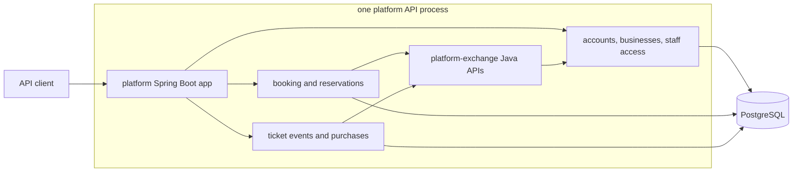
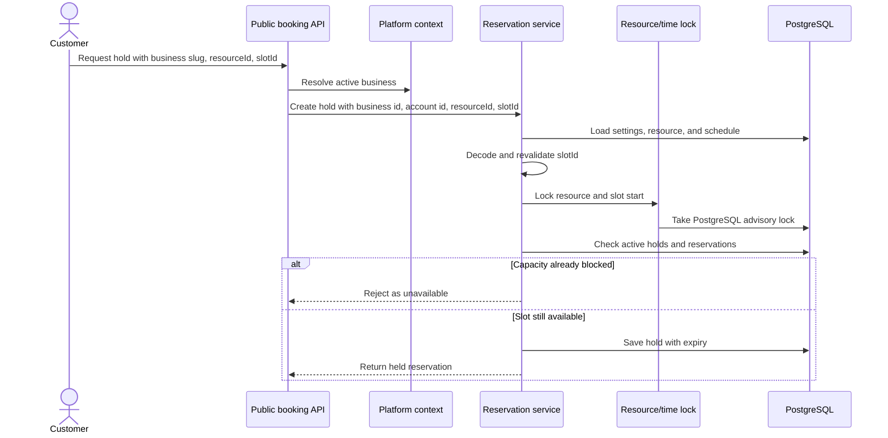

# resrv

[](https://github.com/jaeyeopme/resrv/actions/workflows/ci.yml)

`resrv` is a backend project for business reservation workflows. It is built
with Java 25 and Spring Boot 4, and focuses on backend engineering rather than a
full product UI.

The project demonstrates a modular-monolith backend with bounded-context
modules, generated OpenAPI, PostgreSQL persistence, account-scoped security,
server-side authorization, concurrency-safe reservation holds, selected-seat
ticket purchases, and automated quality gates.

It is not a production deployment template. Payments, a first-party UI,
notification workflows, external calendar sync, and runtime service splitting
are intentionally outside the current scope.

## At A Glance

| Area | Current state |
|---|---|
| Purpose | Backend API for reservation and ticketing workflows |
| Runtime | One supported Spring Boot API from the `platform` module |
| Language | Java 25 |
| Framework | Spring Boot 4, Spring MVC, Spring Security |
| Persistence | PostgreSQL 16, Flyway, Spring Data JPA |
| API contract | Generated OpenAPI from the running platform API |
| Modules | `platform`, `timeslot`, `ticketing`, `platform-exchange`, `shared-kernel` |
| Verification | Gradle `check`, Testcontainers, ArchUnit, JaCoCo, Checkstyle, Spotless, OpenRewrite |

## Design Highlights

The repository is structured to make core backend design choices easy to inspect:

- **Bounded contexts**: platform identity, booking, ticketing, exchange APIs,
  and shared primitives are separated by Gradle modules and package rules.
- **Authorization model**: JWTs identify only the account. Business access,
  reservation ownership, and ticket activity access are resolved server-side.
- **Correctness under contention**: reservation holds use PostgreSQL advisory
  locks and active blocker checks; ticket purchase confirmation uses
  all-or-nothing selected-seat ownership and idempotency replay.
- **API contract discipline**: generated OpenAPI is the endpoint and schema
  contract; hand-written endpoint catalogs are avoided.
- **Quality gates**: tests cover domain behavior, application use cases,
  persistence, API flows, runtime wiring, architecture rules, and coverage
  thresholds.

## Quick Start

Prerequisites:

- JDK 25.
- Docker, because integration tests use Testcontainers.
- Node 24 if you want commitlint and Lefthook installed locally.

Install repository tooling:

```bash
npm ci
npm run hooks:install
```

Run the main verification path:

```bash
./gradlew spotlessApply
./gradlew rewriteDryRun
./gradlew check
```

Run the API locally:

```bash
./gradlew :platform:bootRun
```

When no active Spring profile is set, `bootRun` uses the local profile. Start it
from the repository root so Spring Boot Docker Compose support can discover
`compose.yml`.

Open the generated API and health surfaces:

- Swagger UI: <http://localhost:8080/swagger-ui.html>
- OpenAPI JSON: <http://localhost:8080/v3/api-docs>
- OpenAPI YAML: <http://localhost:8080/v3/api-docs.yaml>
- Liveness: <http://localhost:8080/actuator/health/liveness>
- Readiness: <http://localhost:8080/actuator/health/readiness>

## Implemented Scope

| Area | Implemented behavior |
|---|---|
| Identity | Account registration, login, account-scoped JWTs, inactive-account rejection |
| Account recovery | Repeated failed password sign-in protection and password reset challenge completion |
| Business access | Business creation, owner membership, staff grant/list/audit/update/disable |
| Booking setup | Booking settings, resources, weekly schedules, date override schedules |
| Public booking | Business discovery, active resource discovery, generated slots, authenticated hold creation |
| Reservations | Hold, confirm, release, customer cancel, business cancel, check-in, no-show, customer history, business search |
| Ticketing | Ticket events, sale windows, tiered inventory, selected seats, purchase confirmation, customer history, business activity |
| Runtime | One platform API serving platform, booking, and ticketing API groups |

## Architecture

The app runs as one Spring Boot process from the `platform` module. `timeslot`
and `ticketing` contribute booking and ticketing behavior to that process.
`platform-exchange` is a plain Java module for cross-context lookup and access
decisions. It is not HTTP, messaging, or an outbox layer.



Module roles:

| Module | Role |
|---|---|
| `shared-kernel` | Shared identity and timezone primitives |
| `platform-exchange` | Pure Java APIs used by other modules to ask platform for business and access decisions |
| `platform` | Accounts, login, businesses, memberships, security, migrations, and the runnable API |
| `timeslot` | Booking settings, resources, schedules, generated slots, and reservations |
| `ticketing` | Ticket events, inventory, selected seats, purchases, history, and business activity |

`timeslot` and `ticketing` do not depend on platform implementation packages or
platform persistence tables. They use `platform-exchange` for platform-owned
facts and access decisions. Their local `bootRun` and `bootJar` tasks remain
disabled, so there is one supported backend runtime.

More detail: [docs/architecture.md](docs/architecture.md) and
[docs/trd.md](docs/trd.md).

## Correctness Examples

### Reservation Holds

Hold creation starts from a public business slug. The platform context resolves
the active business, then timeslot validates the resource, slot identity, and
capacity before saving a hold. The hold path revalidates generated slot identity
against current settings and schedule data, then protects the resource/time
range with a PostgreSQL advisory lock before checking active blockers.



Reservation state is derived from timestamp facts on the reservation row. Held,
confirmed, and checked-in reservations block capacity. Expired, released,
cancelled, and no-show reservations do not.

### Ticket Purchases

Ticketing models selected-seat purchases as the first durable lifecycle action:

- A successful confirmation creates one ticket purchase and marks every selected
  seat as purchased.
- Multi-seat confirmation is all-or-nothing.
- Contending customers cannot oversell a selected seat.
- Customer-scoped idempotency keys replay the original public outcome for 24
  hours.
- Changed same-key retries and retained expired keys return stable public
  problem reasons.

## API Contract

The platform runtime generates the API contract:

- Swagger UI: `/swagger-ui.html`
- OpenAPI JSON: `/v3/api-docs`
- OpenAPI YAML: `/v3/api-docs.yaml`

The repository does not maintain a hand-written `docs/api.md` endpoint catalog
or a committed OpenAPI snapshot. Narrative docs describe product scope,
architecture, security boundaries, and testing strategy. Exact paths, methods,
schemas, and response documentation come from generated OpenAPI.

## Generated Artifacts

Inspection artifacts are generated by the existing build instead of committed:

| Artifact | How to generate | Where to inspect |
|---|---|---|
| Generated OpenAPI | `./gradlew :platform:bootRun` | `/v3/api-docs`, `/v3/api-docs.yaml`, Swagger UI |
| Test reports | `./gradlew check` | `*/build/reports/tests/test/index.html` |
| Coverage reports | `./gradlew check` | `*/build/reports/jacoco/test/html/index.html` |
| Checkstyle reports | `./gradlew check` | `*/build/reports/checkstyle/*.html` |
| Executable API jar | `./gradlew :platform:bootJar` | `platform/build/libs/resrv-platform-api-0.0.1-SNAPSHOT.jar` |
| Local container image | `./gradlew :platform:jibDockerBuild` | `resrv-platform-api:latest` |

No extra standalone artifact file is required now. Static OpenAPI snapshots,
Postman collections, exported ERD images, and operations guides would duplicate
generated OpenAPI, Flyway migrations, runtime health probes, or the existing
design documents.

## Design Artifacts

Visual design artifacts are kept as Mermaid diagrams in Markdown so they stay
close to the decisions they explain:

| Artifact | Location |
|---|---|
| Runtime and bounded-context map | [Architecture](#architecture) |
| Reservation hold sequence | [Reservation Holds](#reservation-holds) |
| Module dependency map | [docs/architecture.md](docs/architecture.md#current-module-state) |
| Persistence ownership map | [docs/architecture.md](docs/architecture.md#persistence-access-policy) |

## Quality Gates

The primary check sequence is:

```bash
./gradlew spotlessApply
./gradlew rewriteDryRun
./gradlew check
```

`check` covers compilation, tests, Checkstyle, ArchUnit tests, JaCoCo report
generation, and coverage verification. CI also runs commitlint and CodeQL.

Focused checks:

```bash
./gradlew :platform:test --tests '*Ticketing*'
./gradlew :platform:test --tests io.resrv.platform.api.PlatformRuntimePackagingIntegrationTest
./gradlew :platform:test --tests io.resrv.platform.api.PlatformOperationalReadinessIntegrationTest
```

## Documentation Map

| Document | Purpose |
|---|---|
| [docs/prd.md](docs/prd.md) | Product scope, concepts, flows, acceptance criteria, and open product questions |
| [docs/trd.md](docs/trd.md) | Current technical design, runtime, persistence, security, and configuration reference |
| [docs/architecture.md](docs/architecture.md) | Bounded contexts, module boundaries, correctness patterns, and traffic guidance |
| [docs/security.md](docs/security.md) | Authentication, authorization, public exposure, data boundaries, and deferred hardening |
| [docs/testing.md](docs/testing.md) | Test strategy, quality gates, coverage thresholds, and focused verification commands |
| [docs/adr/README.md](docs/adr/README.md) | Architecture decision record index |
| [AGENTS.md](AGENTS.md) | Repository automation rules and agent guardrails |

Feature planning history lives under `specs/`. ADRs and generated OpenAPI are
the durable technical and API contract sources.

## Project Boundaries

Current non-goals:

- Payments, deposits, invoices, and refunds.
- Staff invitation delivery and acceptance UI.
- Password reset UI. Backend challenge completion exists.
- Notifications and reminders, except SMTP-compatible password reset delivery.
- External calendar sync.
- Separate `timeslot` or `ticketing` runtimes.
- Message broker, outbox, event projections, and production runtime splitting.
- Ticketing checkout attempts, failed-attempt persistence, holds, cancellations,
  expiration records, waitlists, resale, public marketing discovery, and seating
  map editing.
