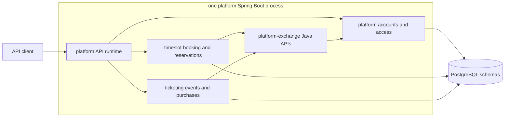
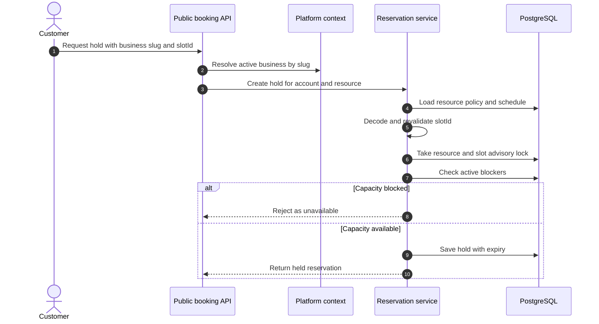
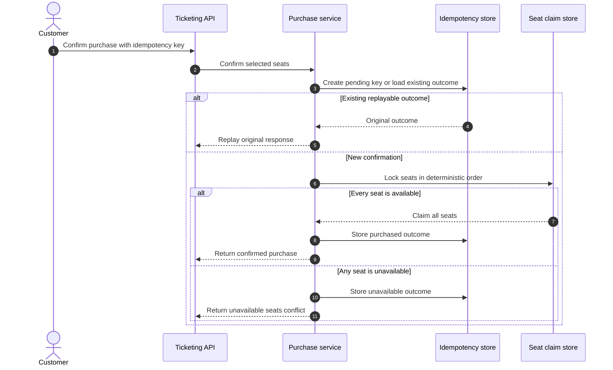

# resrv

> Contention-safe reservation and selected-seat ticketing backend in Java 25.

[](https://github.com/jaeyeopme/resrv/actions/workflows/ci.yml)

`resrv` is a Spring Boot 4 and PostgreSQL backend for businesses that manage
scarce capacity: time slots, resources, and selected seats.

The interesting part is not CRUD. This repo focuses on the paths that usually
break first in reservation systems:

- two customers trying to hold the same time range
- two customers trying to buy the same selected seat
- the same purchase confirmation being retried
- a generated slot becoming stale after schedule or policy changes
- business access changing after a JWT has already been issued

The result is one modular-monolith API with generated OpenAPI, PostgreSQL-backed
contention control, account-scoped security, bounded-context package rules, and
automated verification.

## At a glance

| Area | Current state |
|---|---|
| Purpose | Scarce-capacity API for reservation holds and selected-seat ticket purchases |
| Runtime | One supported Spring Boot API from the `platform` module |
| Language | Java 25 |
| Framework | Spring Boot 4, Spring MVC, Spring Security |
| Persistence | PostgreSQL 16, Flyway, Spring Data JPA |
| API contract | Generated OpenAPI from the running platform API |
| Modules | `platform`, `timeslot`, `ticketing`, `platform-exchange`, `shared-kernel` |
| Verification | Gradle `check`, Testcontainers, ArchUnit, JaCoCo, Checkstyle, Spotless, OpenRewrite |

## Start here

| If you want to... | Read or run |
|---|---|
| Run the API locally | [Quick start](#quick-start) |
| Inspect endpoints and schemas | [API contract](#api-contract) |
| Understand the module split | [Architecture](#architecture) |
| Review concurrency behavior | [Correctness examples](#correctness-examples) |
| Verify a change | [Quality gates](#quality-gates) |
| Cut a public artifact | [Releases and packages](#releases-and-packages) |

## Repository layout

```text
.
|-- .github/
|   |-- pull_request_template.md
|   `-- workflows/
|       |-- ci.yml
|       `-- release.yml
|-- config/
|   `-- checkstyle/
|-- docs/
|   |-- adr/
|   |-- architecture.md
|   |-- prd.md
|   |-- security.md
|   |-- testing.md
|   `-- trd.md
|-- gradle/
|   `-- libs.versions.toml
|-- platform/
|   `-- src/
|-- platform-exchange/
|   `-- src/
|-- shared-kernel/
|   `-- src/
|-- ticketing/
|   `-- src/
|-- timeslot/
|   `-- src/
|-- AGENTS.md
|-- LICENSE
|-- README.md
|-- build.gradle.kts
|-- compose.yml
|-- settings.gradle.kts
`-- rewrite.yml
```

Generated Gradle outputs, local IDE state, local environment files, and local
agent working directories are intentionally ignored.

## What to inspect

The codebase is organized around a few backend guarantees:

- Gradle modules and package rules separate platform identity, booking,
  ticketing, exchange APIs, and shared primitives.
- JWTs identify only the account. Business access, reservation ownership, and
  ticket activity access are resolved server-side.
- Reservation holds use PostgreSQL advisory locks and active blocker checks
  instead of trusting previously generated availability.
- Ticket purchase confirmation uses all-or-nothing selected-seat ownership and
  customer-scoped idempotency replay.
- Generated OpenAPI is the endpoint and schema contract. The repository avoids a
  hand-written endpoint catalog.
- Tests cover domain behavior, application use cases, persistence, API flows,
  runtime wiring, architecture rules, and coverage thresholds.

## Quick start

Prerequisites:

- JDK 25.
- Docker for local PostgreSQL and Testcontainers-backed checks.
- Node 24 if you want commitlint and Lefthook installed locally.

Run the API locally:

```bash
./gradlew :platform:bootRun
```

When no active Spring profile is set, `bootRun` uses the local profile. Start it
from the repository root so Spring Boot Docker Compose support can discover
`compose.yml`.

Open the generated API and health surfaces:

- Swagger UI: <http://localhost:8080/swagger-ui.html>
- OpenAPI JSON: <http://localhost:8080/v3/api-docs>
- OpenAPI YAML: <http://localhost:8080/v3/api-docs.yaml>
- Liveness: <http://localhost:8080/actuator/health/liveness>
- Readiness: <http://localhost:8080/actuator/health/readiness>

Install repository tooling when you plan to commit:

```bash
npm ci
npm run hooks:install
```

Run the main verification path before opening a PR:

```bash
./gradlew spotlessApply
./gradlew rewriteDryRun
./gradlew check
```

## Implemented scope

| Area | Implemented behavior |
|---|---|
| Identity | Account registration, login, account-scoped JWTs, inactive-account rejection |
| Account recovery | Repeated failed password sign-in protection and password reset challenge completion |
| Business access | Business creation, owner membership, staff grant/list/audit/update/disable |
| Booking setup | Booking settings, resources, weekly schedules, date override schedules |
| Public booking | Business discovery, active resource discovery, generated slots, authenticated hold creation |
| Reservations | Hold, confirm, release, customer cancel, business cancel, check-in, no-show, customer history, business search |
| Ticketing | Ticket events, sale windows, tiered inventory, selected seats, purchase confirmation, customer history, business activity |
| Runtime | One platform API serving platform, booking, and ticketing API groups |

Terminology:

- Booking means the broader scheduling workflow: settings, resources, schedules,
  generated slots, discovery, and hold creation.
- Reservation means the persisted time-range record and lifecycle facts: hold,
  confirm, release, cancel, check-in, and no-show.

## Architecture

The app runs as one Spring Boot process from the `platform` module. `timeslot`
and `ticketing` contribute booking and ticketing behavior to that process.
`platform-exchange` is a plain Java module for cross-context lookup and access
decisions. It is not HTTP, messaging, or an outbox layer.

The runtime path is simple:

1. API clients call the `platform` Spring Boot app.
2. The platform runtime assembles platform, booking, and ticketing API groups.
3. `timeslot` and `ticketing` ask platform-owned lookup and access questions
   through `platform-exchange`.
4. Each bounded context owns its PostgreSQL schema and migrations.



Module roles:

| Module | Role |
|---|---|
| `shared-kernel` | Shared identity and timezone primitives |
| `platform-exchange` | Pure Java APIs used by other modules to ask platform for business and access decisions |
| `platform` | Accounts, login, businesses, memberships, security, migrations, and the runnable API |
| `timeslot` | Booking settings, resources, schedules, generated slots, and reservations |
| `ticketing` | Ticket events, inventory, selected seats, purchases, history, and business activity |

`timeslot` and `ticketing` do not depend on platform implementation packages or
platform persistence tables. They use `platform-exchange` for platform-owned
facts and access decisions. Their local `bootRun` and `bootJar` tasks remain
disabled, so there is one supported backend runtime.

More detail: [docs/architecture.md](docs/architecture.md) and
[docs/trd.md](docs/trd.md).

## Correctness examples

### Reservation holds

Hold creation starts from a public business slug. The platform context resolves
the active business, then timeslot validates the resource, slot identity, and
capacity before saving a hold. The hold path revalidates generated slot identity
against current settings and schedule data, then protects the resource/time
range with a PostgreSQL advisory lock before checking active blockers.

The write path is:

1. Resolve the active business from the public slug.
2. Decode and revalidate the opaque `slotId`.
3. Lock the resource and slot start in PostgreSQL.
4. Check active blockers.
5. Save the hold only when capacity is still available.



Reservation state is derived from timestamp facts on the reservation row. Held,
confirmed, and checked-in reservations block capacity. Expired, released,
cancelled, and no-show reservations do not.

### Ticket purchases

Ticketing treats purchase confirmation as the first persisted ticket action:

- A successful confirmation creates one ticket purchase and marks every selected
  seat as purchased.
- Multi-seat confirmation is all-or-nothing.
- Contending customers cannot oversell a selected seat.
- Customer-scoped idempotency keys replay the original public outcome for 24
  hours.
- Retries with changed details and retained expired keys return stable public
  problem reasons.



## API contract

The platform runtime generates the API contract:

- Swagger UI: `/swagger-ui.html`
- OpenAPI JSON: `/v3/api-docs`
- OpenAPI YAML: `/v3/api-docs.yaml`

The repository does not maintain a hand-written `docs/api.md` endpoint catalog
or a committed OpenAPI snapshot. Narrative docs describe product scope,
architecture, security boundaries, and testing strategy. Exact paths, methods,
schemas, and response documentation come from generated OpenAPI.

## Build outputs

Local build and runtime commands produce the files a reviewer needs:

| Evidence | How to generate | Where to inspect |
|---|---|---|
| OpenAPI contract | `./gradlew :platform:bootRun` | `/v3/api-docs`, `/v3/api-docs.yaml`, Swagger UI |
| Test reports | `./gradlew check` | `*/build/reports/tests/test/index.html` |
| Coverage reports | `./gradlew check` | `*/build/reports/jacoco/test/html/index.html` |
| Checkstyle reports | `./gradlew check` | `*/build/reports/checkstyle/*.html` |
| High-contention API behavior | `./gradlew :platform:test --tests '*Concurrency*' --tests '*HighContention*'` | Platform test report |
| Executable API jar | `./gradlew :platform:bootJar` | `platform/build/libs/resrv-platform-api-0.0.1-SNAPSHOT.jar` |
| Local container image | `./gradlew :platform:jibDockerBuild` | `resrv-platform-api:latest` |

The repository does not need extra snapshot files right now. Static OpenAPI
snapshots, Postman collections, exported ERD images, and operations guides would
duplicate generated OpenAPI, Flyway migrations, runtime health probes, or the
existing design documents. Presentation and sales assets belong outside this
repository.

## Releases and packages

Tagged releases use `vMAJOR.MINOR.PATCH`, for example `v0.1.0`.

When a matching tag is pushed, `.github/workflows/release.yml`:

1. Runs OpenRewrite dry run and `check`.
2. Builds the platform executable jar with the tag version.
3. Creates a GitHub Release with the jar attached.
4. Publishes the runnable API image to GitHub Container Registry as
   `ghcr.io/jaeyeopme/resrv-platform-api:MAJOR.MINOR.PATCH`.

Manual releases can also be started from the GitHub Actions tab with the same
version format. Java module jars are not published to Maven packages yet because
only the `platform` API runtime is a supported public artifact.

## Architecture references

Architecture detail lives in docs and ADRs:

| Reference | Location |
|---|---|
| Runtime and bounded-context map | [docs/architecture.md](docs/architecture.md#bounded-contexts) |
| Module dependency map | [docs/architecture.md](docs/architecture.md#current-module-state) |
| Persistence ownership map | [docs/architecture.md](docs/architecture.md#persistence-access-policy) |
| Contention correctness catalog | [docs/architecture.md](docs/architecture.md#high-contention-correctness-guidance) |

## Quality gates

The primary check sequence is:

```bash
./gradlew spotlessApply
./gradlew rewriteDryRun
./gradlew check
```

`check` covers compilation, tests, Checkstyle, ArchUnit tests, JaCoCo report
generation, and coverage verification. CI also runs commitlint and CodeQL.

Focused checks:

```bash
./gradlew :platform:test --tests '*Ticketing*'
./gradlew :platform:test --tests '*Concurrency*' --tests '*HighContention*'
./gradlew :platform:test --tests io.resrv.platform.api.PlatformRuntimePackagingIntegrationTest
./gradlew :platform:test --tests io.resrv.platform.api.PlatformOperationalReadinessIntegrationTest
```

## Documentation map

| Document | Purpose |
|---|---|
| [docs/prd.md](docs/prd.md) | Product scope, concepts, flows, acceptance criteria, and open product questions |
| [docs/trd.md](docs/trd.md) | Current technical design, runtime, persistence, security, and configuration reference |
| [docs/architecture.md](docs/architecture.md) | Bounded contexts, module boundaries, and contention correctness patterns |
| [docs/security.md](docs/security.md) | Authentication, authorization, public exposure, data boundaries, and deferred hardening |
| [docs/testing.md](docs/testing.md) | Test strategy, quality gates, coverage thresholds, and focused verification commands |
| [docs/adr/README.md](docs/adr/README.md) | Architecture decision record index |

## License

This project is licensed under the [MIT License](LICENSE).

## Project boundaries

Out of scope now:

- Load benchmarking, traffic simulation, and production capacity planning.
- Payments, deposits, invoices, and refunds.
- Staff invitation delivery and acceptance UI.
- Password reset UI. Backend challenge completion exists.
- Notifications and reminders, except SMTP-compatible password reset delivery.
- External calendar sync.
- Separate `timeslot` or `ticketing` runtimes.
- Message broker, outbox, event projections, and production runtime splitting.
- Ticketing checkout attempts, failed-attempt persistence, holds, cancellations,
  expiration records, waitlists, resale, public marketing discovery, and seating
  map editing.
