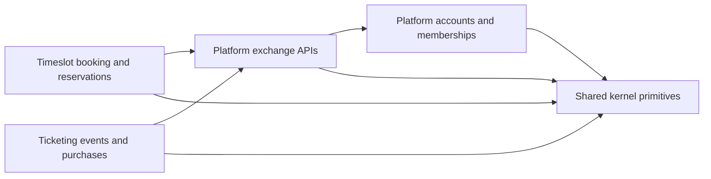
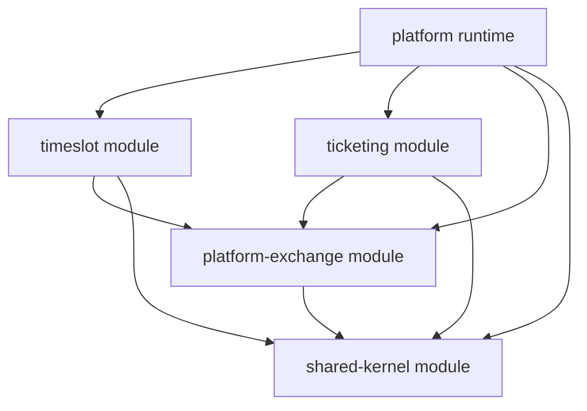
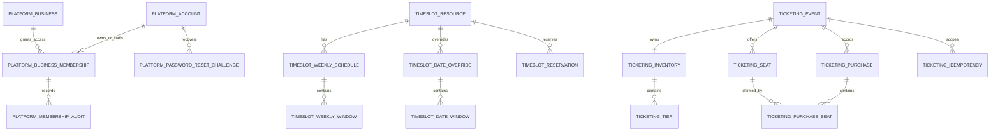

# Architecture

`resrv` uses bounded contexts and hexagonal boundaries. This document describes the implemented
architecture; ADRs record the decisions.

## Bounded contexts

| Context | Owns |
|---|---|
| Platform | Account identity, login, business creation, business membership |
| Platform exchange | Published platform-owned lookup and decision APIs for other contexts |
| Timeslot | Booking settings, resources, schedules, virtual slots, reservations |
| Ticketing | Ticket sale events, sale windows, tiered inventory, selected seats, and ticket purchases |
| Shared kernel | Stable identity and time primitives shared by contexts |



## Current module state

The backend uses bounded-context Gradle modules. The bounded-context collapse is
recorded in [ADR-0017](adr/0017-collapse-to-bounded-context-modules.md),
and the dedicated exchange module is recorded in
[ADR-0020](adr/0020-platform-exchange-boundary.md).

```text
shared-kernel
platform-exchange
platform
ticketing
timeslot
```



[ADR-0001](adr/0001-bounded-context-module-baseline.md) records the superseded 11-module baseline.
Hexagonal layers are enforced as packages.

## Dependency direction

Dependency direction points inward:

```text
api/runtime -> adapters -> application -> domain
```

Rules:

- Domain code must not depend on Spring, JPA, adapters, application services, or API runtime.
- Application code defines ports and use cases.
- Adapters implement ports.
- API packages assemble web, persistence, security, and configuration.
- Timeslot and ticketing code must not depend on platform domain, adapters, API runtime,
  repositories, entities, or persistence schema. Their outbound platform adapters may depend only on
  explicit `platform-exchange` APIs. Platform application services implement those APIs inside the
  platform module.
- Direct database access primitives are limited to outbound adapters.

## Persistence access policy

Owned persistence defaults to Spring Data JPA repositories inside `adapter.out.persistence`.
Database-specific behavior may use native SQL or JDBC only inside outbound adapters. Production code
currently uses timeslot PostgreSQL advisory locks for reservation holds, ticketing selected-seat row
coordination with deterministic ordering, and ticketing idempotency-key advisory locks for purchase
confirmation.

The persistence map is conceptual. Timeslot and ticketing store platform ids as UUIDs but do not
add cross-schema foreign keys to platform tables.



## Platform context

Platform uses:

- `Account` for identity.
- `Business` for organization ownership.
- `BusinessMembership` for `OWNER` and `STAFF` access.
- `BusinessMembershipAuditEntry` for append-only grant, reactivation, role-change, and disablement
  history.
- Sign-in protection and password reset challenges for account recovery.

Account-scoped JWTs identify the caller. Business access is resolved server-side from membership
data.

## Account security

Platform owns repeated password failure tracking, password reset challenge persistence, reset token
digesting, password hash update, and SMTP-compatible reset email delivery. Password reset delivery is
an outbound adapter behind an application port.

Active-state checks stay server-side. Platform protected requests reject inactive accounts after JWT
authentication. Business-scoped owner/staff decisions require active account, active business, and
active membership. Timeslot consumes those decisions only through `platform-exchange` APIs.
Membership administration operations are owner-only and preserve at least one active owner per
business.

Platform exposes separate cross-context contracts for different intents:

- `ActiveBusinessLookup`: returns only active businesses for availability, settings, scheduling, and
  booking flows.
- `BusinessSummaryLookup`: returns current display summary data and may include inactive businesses
  for historical customer-owned reservation rendering.
- `BusinessAccessCheck`: returns an authorization decision for business-scoped owner/staff actions;
  callers must not treat a false result as evidence about which underlying record is missing or
  inactive.

See [ADR-0019](adr/0019-platform-contracts-for-timeslot-reads.md) for the decision to use
synchronous platform exchange APIs in the current modular monolith and keep event-backed summary
projections as a future option. See [ADR-0020](adr/0020-platform-exchange-boundary.md) for the
module boundary that keeps those APIs out of the platform implementation module.

## Timeslot context

Timeslot uses:

- `BusinessBookingSettings` for defaults.
- `Resource` for bookable capacity, identified externally and internally by stable resource ID.
- `EffectiveBookingPolicy` to resolve business defaults and resource overrides.
- Weekly schedules and date override schedules.
- Virtual slots encoded as opaque `slotId`.
- Reservation facts for lifecycle transitions.

Slots are not persisted. `SlotGenerator` creates them from business timezone, effective booking
policy, and schedule windows.

Generated slots for one resource do not overlap under the effective policy. Hold requests still
decode and revalidate the opaque `slotId` against current business, resource, timezone, schedule,
policy, and current time before persistence.

Public booking discovery remains reachable for anonymous callers, but inactive businesses or
resources produce no bookable resource or slot results.

Resource names are display/search metadata and are not unique within a business. Timeslot does not
expose resource slugs, handles, or URL-safe resource keys. Business slug remains platform-owned and
continues to scope public booking discovery; resource-scoped public discovery uses business slug
plus resource ID.

## Ticketing context

Ticketing owns ticket sale and purchase lifecycle data:

- `TicketEvent` for a sale opportunity owned by a platform business id.
- `TicketEventProfile` for display title and event occurrence timing.
- `TicketSaleWindow` for sale start/end boundaries.
- `TicketInventory` and `TicketInventoryTier` for tiered capacity counters.
- `TicketSeat` for event-owned selected seats and purchase status.
- `TicketPurchase` for durable customer ownership of purchased seats.
- Purchase confirmation idempotency records for customer-scoped replay of the original public
  outcome.

Ticketing stores platform `businessId` references locally and resolves platform business facts only
through `platform-exchange`. It does not add cross-schema foreign keys to platform tables and does
not read platform persistence directly.

Ticketing exposes selected-seat purchase confirmation, customer ticket history, and authorized
business purchase activity through the platform runtime. Purchase confirmation is the first persisted
ticket lifecycle action: it creates no pre-purchase checkout attempt, hold, cancellation,
expiration, or general failed-attempt record. Customer purchase confirmation requires an
idempotency key, replays the original public outcome for 24 hours, rejects retries with changed
details, and rejects retained expired keys after the replay window. Unavailable selected seats are
reported as `409 Conflict`; idempotency problems expose stable public reasons `invalid_retry` and
`expired_key`.

Seat claiming is concurrency-safe in ticketing outbound persistence. Multi-seat claims use
deterministic seat ordering and all-or-nothing ownership so competing confirmations cannot oversell
or leave partial purchases.

Business purchase activity access is resolved server-side through `platform-exchange` membership
checks. Missing events and events outside the caller's business authority return the same public
not-found style response.

Ticketing IDs are the external identity strategy for ticketing APIs. Slugs, handles, event keys,
title uniqueness, and separate public opaque identifiers are intentionally excluded from this
baseline. Real payment authorization/settlement, queueing, waitlists, resale, and recurring or
multi-session events remain future scope.

## Reservation correctness

Hold creation uses PostgreSQL advisory transaction locking plus an active blocker query. This keeps
correctness independent from cleanup jobs.

Active blockers:

- Confirmed reservations.
- Checked-in reservations.
- Holds whose `holdExpiresAt` is still in the future.

Released, cancelled, no-show, and expired holds do not block capacity.

Reservation lifecycle mutations load the reservation row with a pessimistic write lock before
confirm, release, cancel, check-in, or no-show facts are written. Public API behavior treats blocked
holds, expired-hold confirmation, and conflicting lifecycle transitions as `409 Conflict` while
keeping IDOR-sensitive customer reservation probes as not-found style responses.

Reservation error responses distinguish invalid request shape, unavailable slot identity, and
runtime state conflicts:

- `400 Bad Request`: malformed JSON, missing required fields, invalid UUIDs, or invalid enum values.
- `409 Conflict`: a valid request conflicts with current capacity or lifecycle state, such as an
  already blocked slot, expired hold confirmation, or a conflicting reservation transition.
- `422 Unprocessable Entity`: a syntactically valid hold request references a slot identity that is
  stale, policy-drifted, outside booking range, unavailable, or otherwise not currently bookable.

## High-contention correctness guidance

High-contention work in this project means correctness when many customers compete for the same
limited capacity. New work should start from implemented reservation and ticketing behavior while
preserving bounded-context vocabulary.

Current implementations coordinate scarce capacity through PostgreSQL locks and transactional state.
Runtime sizing and deployment policy belong to separate design.

Canonical terms:

- **Catalog entry**: A proven correctness pattern with source flow, protected invariant, public
  outcome, non-applicability boundary, and review questions.
- **Contention invariant**: A capacity, expiry, retry, lock/claim, lifecycle, or
  authorization property that must remain true under concurrent or repeated actions.
- **Applicability rule**: A rule that classifies future high-contention work as
  `pattern-aligned`, `locally-informed`, or `fresh-spec-required`.
- **Review question**: A question a spec or plan must answer before implementation starts.

| Pattern | Source flow | Protected invariant | Public outcome | Non-applicability boundary |
|---|---|---|---|---|
| Reservation hold active blockers | Timeslot hold creation and reservation lifecycle | A resource time range cannot be actively overbooked by unexpired holds, confirmed reservations, or checked-in reservations. Expired holds stop blocking without cleanup. | Valid unavailable capacity returns conflict or unavailable-slot style responses according to request shape and slot validity. | Do not reuse for selected-seat ownership or idempotency replay; reservations use generated slots and blocker semantics. |
| Selected-seat all-or-nothing ownership | Ticket purchase confirmation | A selected seat has at most one customer owner, and multi-seat purchase confirmation creates either all requested ownership or none. | Losing confirmations return `409 Conflict` unavailable-seat outcomes without partial ownership. | Do not reuse for generated time slots or flows that need separate product state. |
| Expiry as correctness release | Reservation holds | Capacity stops being blocked when `holdExpiresAt` is in the past, regardless of cleanup mutation. | Expired-hold confirmation returns `409 Conflict`; future availability can proceed without deleting the hold row. | Do not use this model for retry records that must retain expired-key rejection behavior. |
| Expiry as retry retention | Ticket purchase idempotency | Same-key replay is available for 24 hours, changed same-key retry is invalid, and retained expired keys reject after replay expiry until cleanup eligibility. | Replays return the original public outcome; invalid or expired retries return stable problem reasons. | Do not treat cleanup as required for purchase correctness or as a failed-attempt ledger. |
| Lifecycle conflict stability | Reservation transitions and ticket purchase confirmation | Terminal, expired, and conflict-producing states remain explicit and return stable public outcomes. | Conflicting reservation transitions and unavailable ticket claims are public conflicts; completed ticket history shows only successful purchases. | New lifecycle states need a separate feature spec. |
| Server-side authority and non-enumeration | Business reservation operations and business ticket activity | Business access is resolved server-side, and IDOR-sensitive probes do not reveal whether inaccessible objects exist. | Missing and unauthorized sensitive lookups use the same not-found style public response. | Non-sensitive validation and operational facts may still expose specific causes when they do not reveal protected object existence. |
| Queue and waitlist boundary | Current reservation and ticketing contention behavior | Current behavior protects correctness without product-level queue, waitlist, or deferred-claim semantics. | Losing customers receive conflict/unavailable outcomes rather than queue positions or deferred claims. | Queueing, waitlists, and runtime policy require separate design. |

Classify future high-contention work this way:

- `pattern-aligned`: The candidate shares a proven invariant and can reuse the review questions
  without changing product capability.
- `locally-informed`: The candidate resembles only one source flow and needs domain-specific
  planning before implementation.
- `fresh-spec-required`: The candidate introduces new product or architecture capability outside
  current guidance.

Review questions:

- Can capacity be overbooked, oversold, or partially claimed under concurrent attempts?
- Does the flow protect generated availability and active blockers, selected ownership, or another
  explicit invariant?
- What repeat-request behavior is expected: replay, invalid retry, expired retry, or new attempt?
- Does expiry release correctness immediately, retain rejection behavior, or only permit cleanup?
- Which lifecycle states are terminal, reversible, expired, or conflict-producing?
- Which public responses must remain stable for losing contention or unauthorized probes?
- Does the feature need a fresh spec or ADR because it adds new product or runtime behavior?

## Decision log

Architecture decisions live in [docs/adr](adr/).
